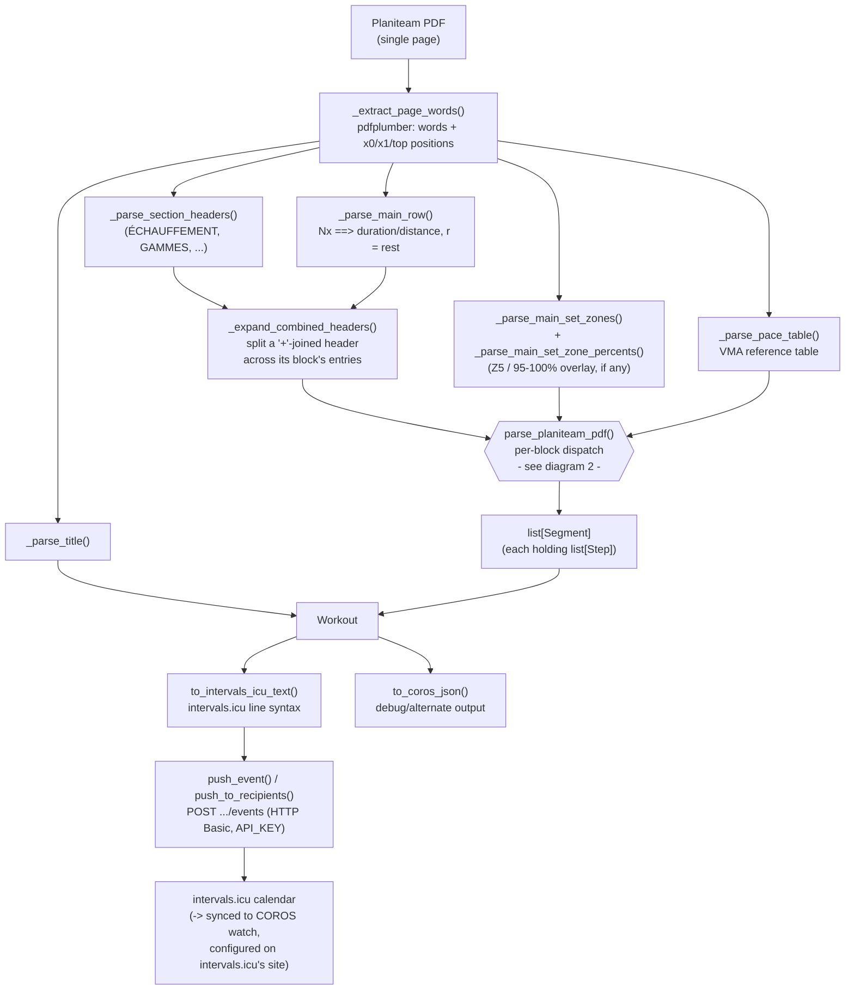
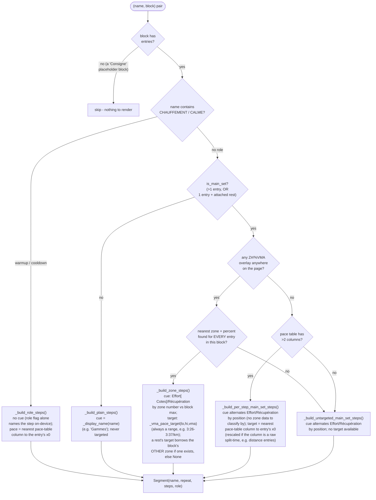

# Architecture of `planiteam_to_coros.py`

This is a map of how the script turns a Planiteam PDF into intervals.icu
structured-workout text. For *why* each design choice was made (and the live
API probing that justified it), see [CLAUDE.md](CLAUDE.md) - this file is
just the shape of the logic.

## 1. End-to-end pipeline

## 2. Per-block target/cue dispatch

This is the core of `parse_planiteam_pdf()`: for every `(name, block)` pair
(after `+`-header expansion), decide **how to label and target** each entry.
Matching between an entry and its zone/percent/pace-table data is always
done by **nearest x-position** (`_nearest_payload` / `_nearest_column_index`,
tolerance `_X0_MATCH_TOL`), never by a flat count or sequence index - that
was the main source of silent breakage across PDF layouts (see
`CLAUDE.md`).

## Key data shapes

- **`Step`** - one rendered line (`- [cue] duration-or-distance [target Pace]`).
  Exactly one of `duration_s` / `distance_m` is set.
- **`Segment`** - a named block (warm-up, main set, ...): `repeat` count,
  `role` (`"warmup"`/`"cooldown"`/`None`, drives the device step-type flag),
  and its `Step`s.
- **`Workout`** - `title` + ordered `Segment`s; renders to either
  intervals.icu's line syntax or a debug JSON doc.
- **entry** (internal, not a public type) - one parsed cell from the
  duration/distance row: `{x0, duration_s, distance_m, distance_unit,
  rest_s}`. `rest_s` is the attached "r = ..." gap *after* this entry,
  matched by nearest x-position rather than by sequence order (see
  `_parse_rest_groups` / `_consume_nearest_rest` in CLAUDE.md).

## Where to look when a new PDF breaks this

1. Dump `page.extract_words()` sorted by `(top, x0)` for the new PDF and
   compare its structural landmarks (`==>`, `r =`, `Nx`, `Z\d`, pace-table
   column x0s) against a working sample - see CLAUDE.md's "Practical notes
   for extending the parser".
2. Everything in diagram 2 is decided *per block*, by x-position matching,
   not by any fixed page coordinate or flat count - if something doesn't
   line up, the fix is almost always "match this by nearest x0 instead of
   assuming a fixed position/order", the same pattern used throughout this
   file.
3. Add the new PDF + a hand-checked `expected.workout.intervals.txt` under
   `example/<date>/` and wire it into `tests/test_planiteam_to_coros.py`.
